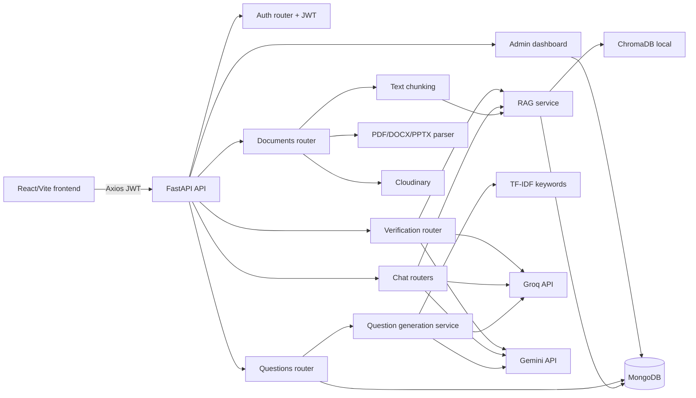
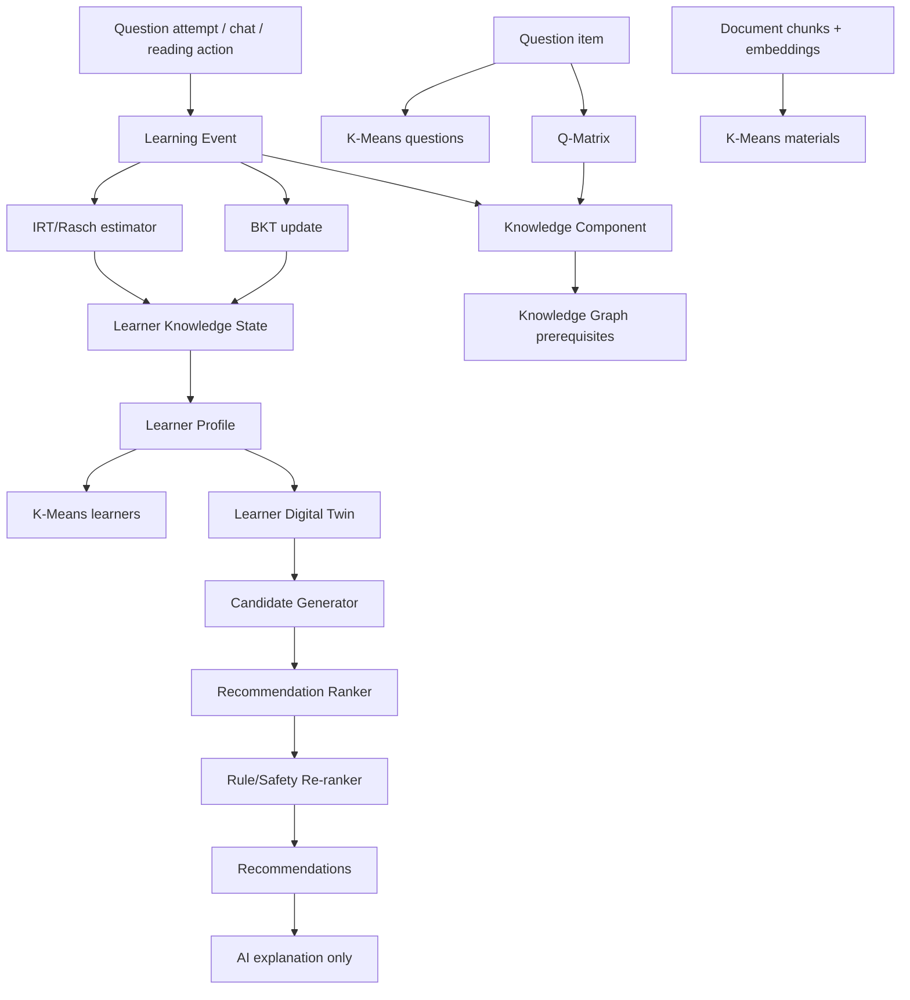

# Audit he thong hien tai truoc khi ca nhan hoa nguoi hoc

Ngay audit: 2026-07-23 (Asia/Ho_Chi_Minh)

Pham vi: chi doc va kiem tra project, khong sua ma nguon. File nay la tai lieu audit duoc tao theo Prompt 0.

## 1. Tom tat stack hien tai

- Backend: FastAPI, async Python, Uvicorn.
- Frontend: React 19 + TypeScript + Vite, React Router, Axios.
- Database chinh: MongoDB qua Motor async driver. Khi Mongo local khong ket noi duoc, backend co fallback sang `mongomock-motor` in-memory cho local/dev.
- Vector database: ChromaDB local persistent client, thu muc mac dinh `backend/chroma_db` neu `CHROMA_PERSIST_DIR=./chroma_db`.
- Luu file: Cloudinary; file upload duoc luu tam trong `backend/uploads`.
- Auth: JWT Bearer token, bcrypt hash password, dependency `get_current_user`.
- AI API:
  - Groq: sinh text/JSON, sinh cau hoi, hoi dap co ban, transcribe video bang Whisper.
  - Gemini/Google GenAI: JSON generation, embeddings, advanced chat, web grounding, verification.
  - Embedding production code dang goi `text-embedding-004`; README co noi `gemini-embedding-001`, can dong bo tai lieu/cau hinh o buoc sau.

## 2. So do kien truc hien tai

## 3. Luong xu ly tai lieu hien tai

1. Frontend `FileUpload` goi `POST /api/v1/documents/upload`.
2. Backend kiem tra JWT, role hien cho phep `user`, `lecturer`, `admin`.
3. File duoc luu tam, upload len Cloudinary, tao document metadata trong `documents`.
4. Neu la PDF/DOCX/PPTX: `document_parser.extract_text` trich text, luu `document_contents`.
5. Neu la video: user goi `POST /documents/{id}/transcribe`, backend tai video, tach audio bang ffmpeg, transcribe bang Groq Whisper, luu transcript vao `document_contents`.
6. User goi `POST /documents/{id}/index`; `split_text_into_chunks` chia chunk, `rag_service.add_document_chunks` tao embedding va luu:
   - chunk metadata vao MongoDB `document_chunks`
   - vectors/documents/metadatas vao ChromaDB collection `document_chunks_<source>_<dimension>d`
7. Status document chuyen sang `indexed`.

Ownership: phan lon route tai lieu goi `get_owned_document(document_id, current_user)`. Mot so truy van sau khi da check ownership van nen them `user_id` trong query de phong du lieu lech/inconsistent.

## 4. Luong sinh cau hoi hien tai

1. Frontend goi `POST /api/v1/questions/generate` voi `document_id`, `question_count`, `difficulty`, `question_type`, optional `bloom_level`.
2. Backend bat buoc document thuoc user hien tai va `status == indexed`.
3. `question_generation_service.generate_questions` doc chunks trong `document_chunks`; neu khong co thi fallback sang `document_contents`.
4. TF-IDF trich keyword tu chunk bang scikit-learn.
5. Groq va/hoac Gemini sinh pool cau hoi JSON dua tren context.
6. Neu ca Groq va Gemini san sang, he thong dung ca hai de cross-validate cau hoi; diem validation 1-5 la diem chat luong cau hoi do AI danh gia, khong phai diem nang luc nguoi hoc.
7. He thong chon top N cau hoi hop le theo avg validation score, classify Bloom bang AI, gan status `draft`.
8. Luu `question_sets` gom questions, validation_stats, keywords, bloom_distribution, workflow_counts.

Ghi chu quan trong cho ca nhan hoa: diem nguoi hoc hien duoc tinh bang thuat toan dung/sai trong `submit_question_attempt`, khong do AI quyet dinh.

## 5. K-Means hien dang hoat dong nhu the nao

Vi tri:
- Backend service: `backend/app/services/clustering_service.py`
- API: `GET /api/v1/documents/analysis/clusters`
- Frontend: `frontend/src/pages/DocumentsPage.tsx`, `frontend/src/api/documentApi.ts`

Dau vao:
- Lay tat ca embeddings trong ChromaDB co `metadata.user_id == current_user.id`.
- Gom theo `metadata.document_id`.
- Moi tai lieu duoc bieu dien bang vector trung binh cua cac chunk embeddings.
- Khong tron embedding voi dac trung so khac.

Thuat toan:
- `find_optimal_k` thu K tu 2 den `min(8, n_samples - 1)` bang Silhouette Score.
- `KMeans(n_clusters=k, random_state=42, n_init=10, max_iter=300)`.
- Neu co <= 1 tai lieu thi tra mot cum; route yeu cau toi thieu 2 tai lieu moi tra clustering.

Ket qua:
- Tra JSON gom `cluster_id`, `document_ids`, `size`, sau do AI label ten cum bang preview document.
- Frontend hien cum tai trang Documents.
- Khong luu cluster assignment, centroid, model, version hay thoi diem chay vao database.

Rui ro K-Means:
- Chay lai moi lan goi API, co the ton chi phi/doc Chroma lon va khong co cache/version.
- Khong luu model/version/feature signature nen khong tai lap duoc ket qua theo thoi diem.
- Vector trung binh cua chunk embeddings khong duoc normalize lai sau khi mean; voi cosine/K-Means can xem lai.
- K-Means dung Euclidean distance mac dinh tren embedding; co the chua phu hop bang cosine/spherical k-means.
- Khong chuan hoa rieng vi chi dung embedding; neu sau nay them feature so phai scale rieng va khong tron thang do tuy tien.
- Route lay doc preview/name chi query theo `document_id`; nen them `user_id` de defense-in-depth.

## 6. Models/collections hien co

Khong thay ODM model rieng; `backend/app/models/__init__.py` rong. Data model thuc te nam trong MongoDB document dict va Pydantic schemas.

Collections dang duoc dung:
- `users`
- `documents`
- `document_contents`
- `document_chunks`
- `question_sets`
- `question_attempts`
- `chat_messages`
- `conversations`
- `conversation_messages`
- `chat_locks`
- `ai_answer_feedback`
- `ai_usage_events`
- `verification_sessions`
- `verification_issues`

## 7. Danh sach API hien co

Base API: `/api/v1`

Auth:
- `POST /auth/register`
- `POST /auth/login`
- `POST /auth/login-swagger`
- `GET /auth/me`

Documents:
- `POST /documents/upload`
- `GET /documents`
- `GET /documents/{document_id}`
- `POST /documents/{document_id}/extract`
- `GET /documents/{document_id}/content`
- `POST /documents/{document_id}/index`
- `GET /documents/{document_id}/chunks`
- `POST /documents/{document_id}/search`
- `POST /documents/{document_id}/transcribe`
- `GET /documents/{document_id}/transcript`
- `DELETE /documents/{document_id}`
- `GET /documents/analysis/clusters`
- `GET /documents/{document_id}/similar`

Verification under `/documents`:
- `POST /documents/{document_id}/verify`
- `GET /documents/{document_id}/verify/status`
- `GET /documents/{document_id}/verify/issues`
- `POST /documents/{document_id}/verify/resolve`
- `POST /documents/{document_id}/verify/apply`

Questions:
- `POST /questions/generate`
- `GET /questions/my-history`
- `GET /questions/document/{document_id}`
- `GET /questions/published`
- `PATCH /questions/{question_set_id}/items/{question_index}`
- `POST /questions/{question_set_id}/items/{question_index}/workflow`
- `POST /questions/{question_set_id}/publish`
- `POST /questions/{question_set_id}/attempts`
- `GET /questions/{question_set_id}/attempts/my`
- `GET /questions/attempts/my-history`
- `GET /questions/{question_set_id}`
- `DELETE /questions/{question_set_id}`
- `GET /questions/{question_set_id}/export/docx`
- `GET /questions/{question_set_id}/export/pdf`

Chat:
- `POST /chat/ask`
- `GET /chat/history/{document_id}`
- `POST /chat/ask-advanced`
- `GET /chat/conversations`
- `GET /chat/conversations/{conversation_id}/messages`
- `PATCH /chat/conversations/{conversation_id}`
- `DELETE /chat/conversations/{conversation_id}`
- `PUT /chat/messages/{message_id}/feedback`

Admin:
- `GET /admin/dashboard/overview`
- `GET /admin/dashboard/usage`
- `GET /admin/dashboard/quality`
- `GET /admin/dashboard/errors-latency`
- `GET /admin/dashboard/evaluation`

Health/db:
- `GET /`
- `GET /health`
- `GET /health/ready`
- `GET /db/ping`

## 8. Thanh phan co the tai su dung

Models/collections co the mo rong:
- `users`: them learner preferences/profile summary.
- `documents`, `document_contents`, `document_chunks`: gan knowledge components, document cluster, metadata hoc lieu.
- `question_sets.questions`: them `knowledge_component_ids`, `q_matrix_row`, `irt_difficulty`, `discrimination`, `guessing`, `skill_tags`.
- `question_attempts`: lam nguon migration sang `learning_events`.
- `conversations`, `conversation_messages`, `ai_answer_feedback`: dung lam tin hieu hanh vi hoc va feedback, nhung can tach voi event hoc tap chinh.
- `ai_usage_events`: tai su dung cho observability.

Services co the tai su dung:
- `document_parser.py`, `text_chunking_service.py`
- `rag_service.py` cho embedding/search/re-rank
- `question_generation_service.py` cho sinh cau hoi va TF-IDF keyword prompt
- `tfidf_service.py` cho keywords algorithmic
- `clustering_service.py` lam nen cho K-Means hoc lieu
- `verification_service.py` cho kiem tra chat luong hoc lieu
- `analytics_service.py` cho logging/aggregation pattern
- `feedback_service.py` cho ownership chain va citation feedback pattern

Frontend co the tai su dung:
- `ProtectedRoute`, `AdminRoute`, `AppLayout`
- `FileUpload`
- `QuestionCard`, `QuestionSetDetailPage`
- `LearningHistoryPage`, `StudentStatisticsPage`
- API clients trong `frontend/src/api/*`
- Advanced chat citation/feedback components neu dung de giai thich de xuat.

## 9. Nhung phan con thieu cho ca nhan hoa

- Knowledge Component model.
- Knowledge Graph va quan he prerequisite.
- Q-Matrix mapping question -> knowledge components.
- Learning Event schema chuan hoa moi hanh vi hoc tap.
- Learner Profile rieng voi quyen so huu.
- Learner Knowledge State theo user/KC.
- BKT update algorithm.
- IRT/Rasch calibration va ability estimation.
- K-Means cho cau hoi va nguoi hoc.
- Learner Digital Twin snapshot/version.
- Candidate Generator, Ranker, Re-ranker.
- Recommendation explanations bang AI sau khi ranking thuat toan da tinh.
- Contextual Bandit cho giai doan nang cao.
- Cluster/model/version store.

## 10. Rui ro ky thuat va bao mat

- Secret that trong `backend/.env` va `frontend/.env` nam trong workspace. Khong dua gia tri vao bao cao, nhung nen rotate neu da tung commit/chia se.
- MongoDB local khong chay trong lan kiem tra; backend fallback sang mock nen health van pass nhung khong phan anh database production/local that.
- README co diem lech voi code ve embedding model va mot so mo ta RAG.
- K-Means khong persist ket qua, khong version, chay lai theo request.
- Chua co data-minimum policy cho K-Means nguoi hoc/cau hoi vi chua ton tai.
- `question_attempts` luu lich su lam bai nhung chua co event granularity nhu thoi gian, attempt duration, hint, confidence, step, source context.
- `question_attempts.answers` chi luu answer/correctness/correct_answer theo index; neu question set thay doi sau do co the kho replay chinh xac neu khong snapshot question id/version.
- Published question detail cho learner tra ve correct_answer/explanation trong schema detail; can xac nhan UI/flow co cho xem truoc khi nop khong. Neu co, day la leakage doi voi bai thi.
- Role gate hien bat student moi duoc submit attempt; register chi cho `student`/`lecturer`, nhung mot so helper `_can_manage_questions` cho ca role `user`.
- Mot so truy van sau ownership check nen them `user_id` de tranh bug khi du lieu Mongo inconsistent: `document_contents`, `document_chunks`, doc preview/name trong K-Means/similar.
- AI validation score dang dung cho chat luong cau hoi; can cam dung truc tiep lam diem nang luc nguoi hoc trong cac prompt sau.
- Advanced chat confidence la AI tu bao cao; khong nen dung lam mastery score.
- ChromaDB local tren disk co rui ro mat vector khi deploy tren moi truong ephemeral.

## 11. Kien truc de xuat tich hop ca nhan hoa

Nguyen tac tich hop:
- Moi du lieu ca nhan hoa phai co `user_id` va moi API phai filter theo user dang dang nhap.
- AI chi dung de hieu noi dung, gan nhan, sinh cau hoi/giai thich. Mastery, ability, difficulty calibration, rank score phai do thuat toan tinh.
- Tao service thuat toan rieng cho BKT/IRT/ranking; khong dat logic tinh diem trong prompt AI.
- Moi ket qua cluster/recommendation nen co `model_version`, `feature_version`, `generated_at`, `source_event_range`.

## 12. Thu tu trien khai de xuat

1. Chuan hoa schema nen: `knowledge_components`, `knowledge_graph_edges`, `question_kc_mappings`, `learning_events`.
2. Migration/backfill tu `question_sets` va `question_attempts` sang learning events va Q-Matrix ban dau.
3. Gan KC cho document chunks/questions bang AI labeling co human review; luu ownership/source/version.
4. Implement BKT algorithmic update cho `learner_knowledge_states`.
5. Them Rasch/IRT toi thieu: item difficulty/learner ability tinh bang thuat toan, voi fallback khi du lieu it.
6. Persist K-Means hoc lieu co version/cache; sau do them K-Means cau hoi.
7. Tao Learner Profile + Digital Twin snapshot.
8. Tao Candidate Generator va Recommendation Ranker dua tren gap mastery/prerequisite/recent activity.
9. Them AI explanation endpoint chi dien giai ket qua ranking da tinh.
10. Nang cao: contextual bandit voi logging exposure/click/attempt reward ro rang.

## 13. Danh sach file du kien phai chinh sua o cac buoc sau

Backend:
- `backend/app/database/mongodb.py`
- `backend/app/schemas/question.py`
- `backend/app/schemas/document.py`
- `backend/app/schemas/analytics.py`
- `backend/app/routers/questions.py`
- `backend/app/routers/documents.py`
- `backend/app/routers/chat.py`
- `backend/app/services/question_generation_service.py`
- `backend/app/services/rag_service.py`
- `backend/app/services/clustering_service.py`
- Cac file moi du kien:
  - `backend/app/schemas/personalization.py`
  - `backend/app/routers/personalization.py`
  - `backend/app/services/knowledge_component_service.py`
  - `backend/app/services/q_matrix_service.py`
  - `backend/app/services/learning_event_service.py`
  - `backend/app/services/bkt_service.py`
  - `backend/app/services/irt_service.py`
  - `backend/app/services/recommendation_service.py`
  - `backend/app/services/learner_profile_service.py`

Frontend:
- `frontend/src/App.tsx`
- `frontend/src/api/questionApi.ts`
- `frontend/src/api/documentApi.ts`
- Cac file moi du kien:
  - `frontend/src/api/personalizationApi.ts`
  - `frontend/src/pages/LearnerProfilePage.tsx`
  - `frontend/src/pages/RecommendationsPage.tsx`
  - `frontend/src/pages/KnowledgeMapPage.tsx`
  - `frontend/src/types/personalization.ts`

Docs/tests:
- `backend/tests/*` them unit tests cho BKT/IRT/ranking/ownership.
- `frontend/src/tests/*` them tests cho API payload va UI state ca nhan hoa.
- `evaluation/*` them evaluation cho recommendation va explanation faithfulness.

## 14. Lenh da chay va ket qua

Backend:
- `source .venv/bin/activate && uvicorn app.main:app --host 127.0.0.1 --port 8000`
- Ket qua: backend khoi dong duoc. MongoDB `127.0.0.1:27017` bi refused, app fallback sang Mongo mock in-memory.
- `curl http://127.0.0.1:8000/health`
- Ket qua: `{"status":"ok"}`
- `curl http://127.0.0.1:8000/health/ready`
- Ket qua: HTTP 200, services healthy theo mock/local readiness.
- `curl http://127.0.0.1:8000/api/v1/db/ping`
- Ket qua: `MongoDB mock connected successfully`.

Frontend:
- `npm run dev -- --host 127.0.0.1 --port 5173`
- Ket qua: Vite dev server chay duoc, `curl -I http://127.0.0.1:5173/` tra HTTP 200.
- `npm run build`
- Ket qua: build thanh cong. Co warning chunk JS sau minify > 500 kB.

Tests:
- `source .venv/bin/activate && python -m unittest discover -s tests`
- Ket qua: 81 tests, OK. Log co warning expected trong test; co mot test goi Gemini live do cau hinh `.env` that.
- `npm run test:chat`
- Ket qua: tat ca frontend assertion tests dat.
- `npm run lint`
- Ket qua: ESLint pass.

## 15. Ket luan Prompt 0

- Ma nguon khong duoc sua trong audit nay.
- He thong hien co nen duoc dung lam nen tang, nhung chua nen bat dau Prompt 1 neu muc tieu la chay tren database local thật ma khong mock. Can khoi dong MongoDB local hoac cau hinh MongoDB that truoc.
- Neu chap nhan moi truong test hien tai fallback mock, co the bat dau Prompt 1 sau khi thong nhat: rotate/bao ve secrets, giu framework/database hien tai, va them ownership-first design cho moi collection ca nhan hoa.
