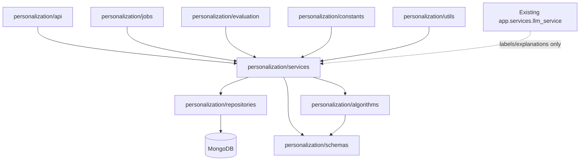
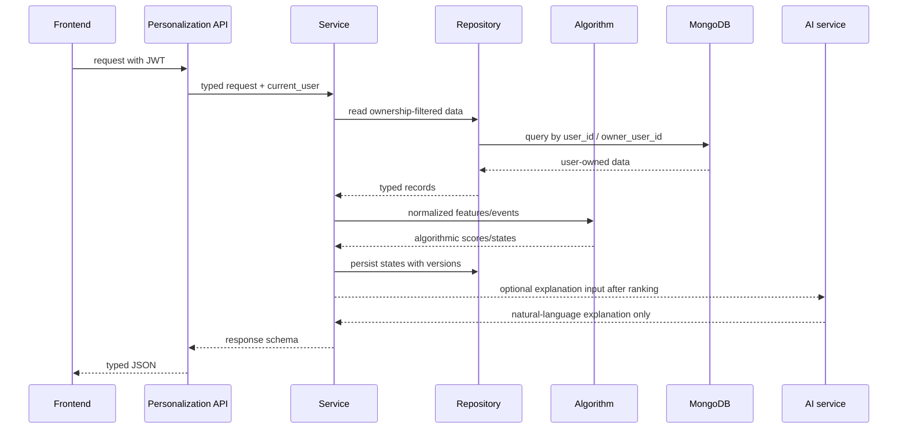

# Personalization architecture and feature flags

Ngay tao: 2026-07-23 (Asia/Ho_Chi_Minh)

Muc tieu Prompt 1: tao nen tang kien truc cho personalization, chua trien khai BKT, IRT, ranking, bandit hay bat ky thuat toan hoc may nang cao nao.

## 1. Nguyen tac giu on dinh he thong cu

- Khong thay framework: backend van la FastAPI, frontend van la React/Vite.
- Khong thay database: MongoDB van la database chinh; ChromaDB van la vector database hien tai.
- Khong thay authentication: tiep tuc dung JWT va `get_current_user`.
- Khong sua API cu neu khong can thiet.
- Module personalization chua duoc dang ky router vao `app.main`, nen khong doi hanh vi runtime cua sinh cau hoi, upload, chat, verification.
- Tat ca flags moi mac dinh tat, tru `FEATURE_SCHEMA_VERSION` la `v1` de danh dau schema metadata dau tien.

## 2. So do module



Hien tai cac package da tao:

```text
backend/app/personalization/
  models/
  schemas/
  repositories/
  services/
  algorithms/
  api/
  jobs/
  evaluation/
  constants/
  utils/
```

## 3. Trach nhiem tung layer

API layer:
- Nhan request, kiem tra auth/role/ownership qua dependency va repository/service.
- Khong chua cong thuc BKT, IRT, clustering, ranking.
- Khong goi truc tiep AI neu chua qua service co boundary.

Schemas layer:
- Dinh nghia Pydantic contracts cho flags, version metadata, API input/output va future documents.
- La noi duy nhat mo ta type cong khai cua module.

Repositories layer:
- La lop duy nhat duoc phep truy cap MongoDB collection moi cua personalization.
- Moi truy van du lieu ca nhan hoa phai filter theo `user_id` hoac ownership scope tu user dang dang nhap.
- Recommendation service va learner service khong duoc goi `get_database()` truc tiep.

Services layer:
- Dieu phoi workflow: build runtime config, goi repository, goi algorithm thuan, goi AI explanation neu flag cho phep.
- Khong dat cong thuc nang luc phuc tap truc tiep trong API.
- Chiu trach nhiem enforce feature flags.

Algorithms layer:
- Chua cac ham thuan cho BKT, IRT/Rasch, K-Means feature preparation, ranking score, re-ranking rule.
- Khong goi API AI, khong goi HTTP, khong goi MongoDB.
- Dau vao phai la du lieu da duoc repository/service loc ownership.

Jobs layer:
- Chay offline/batch cho backfill, model refresh, cluster refresh, calibration.
- Moi job phai ghi version va source data range.

Evaluation layer:
- Kiem tra chat luong recommendation, drift, data leakage, explanation faithfulness.
- Khong cap nhat mastery production.

Constants/utils:
- Chua version default, dependency boundary text, helper nho khong phu thuoc database.

## 4. Luong du lieu de xuat



## 5. Ranh gioi giua AI va thuat toan

AI duoc phep:
- Hieu noi dung hoc lieu.
- Gan nhan Knowledge Component de human/review sau.
- Sinh cau hoi va giai thich.
- Dien giai ly do recommendation dua tren ket qua ranking da tinh.

AI khong duoc phep:
- Cap nhat mastery.
- Tinh learner ability.
- Quyet dinh BKT posterior.
- Tu sap hang recommendation bang prompt.
- Nhin thay du lieu khong thuoc user dang dang nhap.

Thuat toan bat buoc tinh:
- Diem dung/sai, percent.
- BKT posterior.
- IRT/Rasch ability va item difficulty.
- K-Means labels/assignments theo feature matrix da chuan hoa.
- Candidate score, ranking score, re-ranking rule.
- Bandit reward/update neu sau nay bat.

## 6. Feature flags

Da bo sung vao `backend/app/core/config.py` va `backend/.env.example`:

| Flag | Default | Y nghia |
| --- | --- | --- |
| `PERSONALIZATION_ENABLED` | `false` | Root switch cho toan bo personalization |
| `KNOWLEDGE_GRAPH_ENABLED` | `false` | Bat knowledge graph khi co model/API |
| `LEARNER_MODEL_ENABLED` | `false` | Bat learner profile/state update |
| `RECOMMENDATION_ENABLED` | `false` | Bat recommendation pipeline |
| `AI_RECOMMENDATION_EXPLANATION_ENABLED` | `false` | Cho phep AI giai thich recommendation da tinh |
| `BANDIT_ENABLED` | `false` | Bat contextual bandit giai doan nang cao |

Quy tac effective flags:
- Neu `PERSONALIZATION_ENABLED=false`, tat ca child flags phai duoc xem la ineffective du co bi set true do nham cau hinh.
- `BANDIT_ENABLED` mac dinh false va chi duoc bat sau khi co logging exposure/reward day du.
- Chuc nang chua implement khong duoc tao du lieu gia trong production.

## 7. Model versioning

Da bo sung cac truong cau hinh:

| Version field | Default | Du kien luu kem |
| --- | --- | --- |
| `FEATURE_SCHEMA_VERSION` | `v1` | Learning event, feature vector, ranking feature schema |
| `KNOWLEDGE_MODEL_VERSION` | `v0` | KC graph, Q-Matrix, label model |
| `LEARNER_MODEL_VERSION` | `v0` | BKT/IRT learner state |
| `CLUSTERING_MODEL_VERSION` | `v0` | K-Means material/question/learner model |
| `RANKING_MODEL_VERSION` | `v0` | Recommendation scoring/ranker |
| `BANDIT_POLICY_VERSION` | `v0` | Contextual bandit policy |

Quy uoc:
- `v0` = scaffold/off, chua co model production.
- Moi document output tu personalization sau nay phai luu cac version lien quan, `generated_at`, va input data range/source revision.
- Khi thay feature schema, tang `FEATURE_SCHEMA_VERSION` va viet migration/backfill ro rang.

Vi du metadata du kien:

```json
{
  "user_id": "...",
  "feature_schema_version": "v1",
  "knowledge_model_version": "v1",
  "learner_model_version": "bkt-v1",
  "clustering_model_version": "materials-kmeans-v1",
  "ranking_model_version": "ranker-v1",
  "bandit_policy_version": "v0",
  "generated_at": "2026-07-23T00:00:00Z"
}
```

## 8. Chien luoc rollback

Rollback cau hinh:
- Tat `PERSONALIZATION_ENABLED=false` de vo hieu hoa toan bo module.
- Tat tung child flag de rollback tung cap: graph, learner model, recommendation, explanation, bandit.

Rollback du lieu:
- Moi write path sau nay phai ghi version va timestamp.
- Khong overwrite destructive learner state neu chua co snapshot/previous version.
- Neu model moi loi, doc state theo version cu hoac rebuild tu `learning_events`.
- Bandit phai co kill switch rieng va khong anh huong rule-based ranking khi tat.

Rollback API:
- Personalization router chi nen dang ky sau khi feature flag root bat va endpoint da co test ownership.
- API cu cua documents/questions/chat khong phu thuoc module moi de co the rollback doc lap.

## 9. Buoc trien khai tiep theo

1. Tao schemas/repositories cho `knowledge_components`, `knowledge_graph_edges`, `question_kc_mappings`.
2. Them `learning_events` voi ownership, source, event_type, timestamps, version metadata.
3. Backfill event tu `question_attempts` hien co.
4. Them algorithm thuan cho scoring event va BKT v1, co unit test khong can database.
5. Them repositories cho learner profile/state, moi query filter theo `user_id`.
6. Gan KC vao question/document bang AI labeling co review, nhung khong cap nhat mastery.
7. Tao recommendation candidate generator va ranker thuat toan khi `RECOMMENDATION_ENABLED=true`.
8. Them AI explanation sau ranking khi `AI_RECOMMENDATION_EXPLANATION_ENABLED=true`.
9. Chi xem xet bandit khi da co exposure/reward logging va rollback policy.

## 10. Trang thai hien tai sau Prompt 1

Da co:
- Module package import duoc.
- Config flags va version defaults.
- Runtime config schema typed.
- Unit test cho config, default flags, import.

Chua co:
- Collections moi.
- Router personalization.
- BKT/IRT/K-Means nguoi hoc/cau hoi.
- Recommendation pipeline.
- AI recommendation explanation.
- Bandit.
