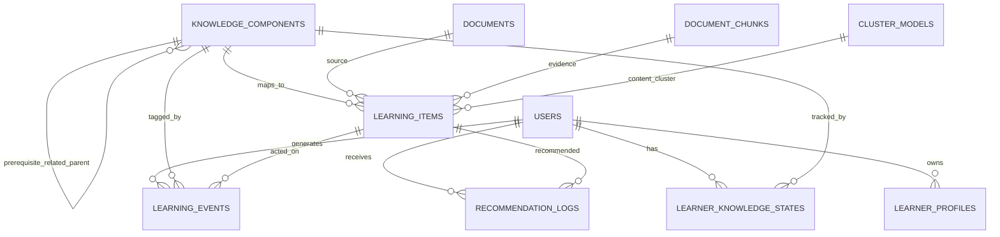

# Personalization data model

Ngay tao: 2026-07-23 (Asia/Ho_Chi_Minh)

Muc tieu Prompt 2: thiet ke schema, repository va index MongoDB cho ho so nguoi hoc. Chua trien khai recommendation algorithm, BKT, IRT, K-Means moi hay AI explanation.

## 1. Tong quan collection



Collections moi:
- `knowledge_components`
- `learning_items`
- `learning_events`
- `learner_profiles`
- `learner_knowledge_states`
- `recommendation_logs`
- `cluster_models`

Tat ca schema nam trong `backend/app/personalization/schemas/data_models.py`.

## 2. knowledge_components

Dung de luu Knowledge Component (KC): don vi kien thuc co the gan vao cau hoi, chunk, bai hoc, va learner state.

Truong toi thieu da co:
- `id`
- `name`
- `normalized_name`
- `description`
- `subject`
- `topic`
- `parent_id`
- `prerequisite_ids`
- `related_ids`
- `difficulty`
- `source_document_ids`
- `evidence_chunk_ids`
- `embedding_reference`
- `status`
- `confidence`
- `created_by`
- `created_at`
- `updated_at`
- `model_version`

Ownership:
- `created_by` luu user tao/label KC.
- KC co the dung chung trong tuong lai, nhung moi API ghi/sua phai kiem tra role va nguon tao.

## 3. learning_items

Dung lam lop lien ket toi cau hoi, bai hoc, doan on tap, document chunk hoac noi dung hoc tap khac.

Truong da co:
- `id`
- `item_type`
- `document_id`
- `source_chunk_ids`
- `knowledge_component_ids`
- `primary_knowledge_component_id`
- `q_matrix_weights`
- `difficulty`
- `discrimination`
- `guessing`
- `bloom_level`
- `estimated_duration_seconds`
- `content_cluster_id`
- `quality_score`
- `verification_status`
- `language`
- `created_at`
- `updated_at`
- `model_version`

Lien ket voi question hien co:
- Khong luu trung toan bo cau hoi.
- Schema bo sung optional `question_set_id`, `question_id`, `question_index` de tro ve `question_sets.questions` hien tai.
- `primary_knowledge_component_id` neu co phai nam trong `knowledge_component_ids`.

## 4. learning_events

Dung de luu hanh vi hoc tap chi tiet. Day la event log append-only de co the rebuild learner state khi rollback model.

Truong da co:
- `id`
- `user_id`
- `session_id`
- `item_id`
- `event_type`
- `knowledge_component_ids`
- `answer`
- `is_correct`
- `score`
- `response_time_ms`
- `hint_count`
- `answer_change_count`
- `attempt_number`
- `skipped`
- `completed`
- `device_context`
- `occurred_at`
- `metadata`
- `schema_version`

Event type toi thieu:
- `item_viewed`
- `lesson_started`
- `lesson_completed`
- `question_started`
- `question_answered`
- `hint_requested`
- `explanation_viewed`
- `recommendation_shown`
- `recommendation_clicked`
- `recommendation_skipped`

Validation:
- `user_id` bat buoc va khong duoc rong.
- `item_id` bat buoc va khong duoc rong.
- Cac count nhu `hint_count`, `answer_change_count`, `attempt_number` khong am.

Ownership:
- Moi repository read/write learning event bat buoc co `user_id`.
- `get_learning_event_for_user(user_id, event_id)` khong tra event neu event thuoc user khac.

## 5. learner_profiles

Dung de luu ho so nguoi hoc cap user.

Truong da co:
- `user_id`
- `learning_goals`
- `preferred_subjects`
- `preferred_content_types`
- `preferred_explanation_style`
- `preferred_session_minutes`
- `global_ability`
- `current_level`
- `ability_cluster_id`
- `behavior_cluster_id`
- `interest_cluster_id`
- `profile_confidence`
- `total_learning_events`
- `cold_start_status`
- `last_active_at`
- `updated_at`
- `model_version`

Ownership:
- Unique theo `user_id`.
- Repository `get_learner_profile(user_id)` bat buoc co user_id va chi tra profile cua user do.

## 6. learner_knowledge_states

Dung de luu learner state tren tung KC.

Truong da co:
- `user_id`
- `knowledge_component_id`
- `mastery_probability`
- `uncertainty`
- `ability_estimate`
- `forgetting_risk`
- `attempt_count`
- `correct_count`
- `recent_accuracy`
- `average_response_time_ms`
- `hint_rate`
- `last_practiced_at`
- `last_updated_at`
- `bkt_state`
- `irt_state`
- `model_version`

Constraint:
- Unique index tren `(user_id, knowledge_component_id)`.
- `correct_count` khong duoc lon hon `attempt_count`.

Ghi chu:
- Prompt 2 chi tao noi luu state. Cong thuc update BKT/IRT se thuoc Prompt sau va phai nam trong algorithm layer.

## 7. recommendation_logs

Dung de luu ket qua de xuat va tin hieu reward/click sau nay.

Truong da co:
- `id`
- `user_id`
- `session_id`
- `item_id`
- `candidate_sources`
- `feature_snapshot`
- `component_scores`
- `final_score`
- `rank_position`
- `reason_codes`
- `shown`
- `clicked`
- `completed`
- `reward`
- `generated_at`
- `learner_model_version`
- `ranking_model_version`
- `bandit_policy_version`

Ghi chu:
- Chua co recommendation algorithm.
- Log nay phuc vu audit, rollback, evaluation va bandit trong giai doan sau.

## 8. cluster_models

Dung de luu metadata/model snapshot cho K-Means va cac cluster tuong lai.

Truong da co:
- `id`
- `cluster_type`
- `version`
- `feature_schema_version`
- `feature_names`
- `normalization_parameters`
- `number_of_clusters`
- `centroids`
- `metrics`
- `training_sample_count`
- `random_state`
- `status`
- `trained_at`
- `activated_at`

`cluster_type` gom:
- `content`
- `question`
- `learner_ability`
- `learner_behavior`
- `learner_interest`

Constraint:
- Unique index tren `(cluster_type, version)`.

## 9. Index da thiet ke

Migration/index helper nam tai:
- `backend/app/personalization/repositories/indexes.py`
- `backend/scripts/migrate_personalization_indexes.py`

Index chinh:
- `knowledge_components`: `normalized_name`, `subject+topic`, `created_by+updated_at`, `model_version`
- `learning_items`: `item_type+document_id`, `knowledge_component_ids`, `primary_knowledge_component_id`, `model_version`
- `learning_events`: `user_id+occurred_at`, `user_id+session_id+occurred_at`, `user_id+item_id+occurred_at`, `item_id`, `knowledge_component_ids`, `schema_version`
- `learner_profiles`: unique `user_id`, cluster ids, `model_version`
- `learner_knowledge_states`: unique `user_id+knowledge_component_id`, `knowledge_component_id`, `user_id+last_updated_at`, `model_version`
- `recommendation_logs`: `user_id+generated_at`, `user_id+session_id+generated_at`, `user_id+item_id+generated_at`, `item_id`, `learner_model_version`, `ranking_model_version`, `bandit_policy_version`
- `cluster_models`: unique `cluster_type+version`, `cluster_type+status`, `feature_schema_version`

## 10. Migration

Script:

```bash
cd backend
source .venv/bin/activate
python scripts/migrate_personalization_indexes.py --dry-run
python scripts/migrate_personalization_indexes.py
```

Tinh chat:
- Khong xoa du lieu.
- Co the chay lai.
- Tao index an toan bang `create_index`.
- Co `--dry-run`.
- Neu `APP_ENV=production`, can truyen `--force-production`.

## 11. Rollback

Rollback code:
- Tat `PERSONALIZATION_ENABLED=false` de khong kich hoat feature sau nay.
- Chua co router moi nen API cu khong phu thuoc cac collection nay.

Rollback data:
- Migration Prompt 2 chi tao index, khong xoa/sua document cu.
- Neu can rollback index, co the drop index theo ten trong `PERSONALIZATION_INDEXES`; khong can drop collection.
- `learning_events` du kien append-only nen co the rebuild learner state sau khi doi model.

## 12. Kiem thu da bao phu

Test file:
- `backend/tests/test_personalization_data_model.py`

Bao phu:
- Schema validation cho 7 model.
- Event hop le tao duoc.
- Event thieu `user_id` hoac `item_id` bi tu choi.
- Index creation.
- Unique constraint `(user_id, knowledge_component_id)`.
- Repository bat buoc `user_id` khi doc learner data.
- Khong doc duoc learning event cua user khac.
- Migration/index creation chay lai khong loi.

## 13. Trang thai sau Prompt 2

Da co:
- Schema database cho KC, item, event, profile, state, recommendation log, cluster model.
- Repository Mongo co ownership guard cho learner data.
- Migration tao index idempotent.
- Tai lieu data model.

Chua co:
- API personalization.
- Backfill tu `question_attempts`.
- Thuat toan BKT/IRT.
- Recommendation candidate/ranker/re-ranker.
- Contextual bandit.
- AI explanation cho recommendation.
